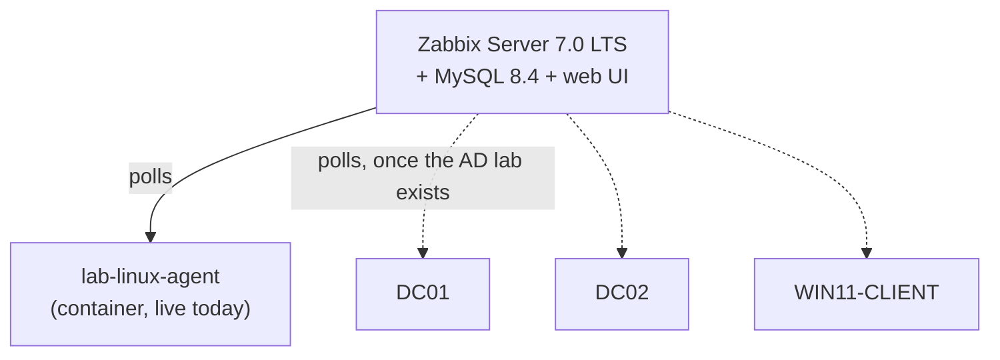

# Infrastructure Monitoring Lab

A Zabbix 7.0 LTS monitoring stack, configured through the Zabbix API rather than by hand, and built to watch the [Active Directory lab](https://github.com/EbubeNnaemeka/active-directory-lab) VMs: uptime, resource thresholds, and agent availability.

## Architecture



## Setup

```bash
cp .env.example .env          # then replace every change-me value
docker compose up -d
python3 scripts/configure_zabbix.py
```

- Web UI: http://127.0.0.1:8081 (bound to localhost only). Log in as `Admin` with `ZBX_ADMIN_PASSWORD` from `.env`.
- `configure_zabbix.py` rotates the default `Admin/zabbix` password, creates host groups, and registers every host in [`hosts.json`](hosts.json) with its template. It's idempotent: running it again updates rather than duplicates.
- The Windows hosts in `hosts.json` are `"enabled": false` until the AD lab VMs exist. Flip them to `true`, install the Zabbix agent on each VM, and re-run the script.

## Alerting

Hosts use Zabbix's built-in templates (`Linux by Zabbix agent`, `Windows by Zabbix agent`), which ship with the triggers this lab relies on:

| Condition | Built-in trigger |
|---|---|
| Host unreachable | Zabbix agent is not available (for 3m) |
| High CPU sustained | High CPU utilization |
| Disk space low | Disk space is low / critically low |
| Recent reboot | Host has been restarted (uptime < 10m) |

## Test results

**2026-09-26 — agent outage test (lab-linux-agent)**

| Step | Result |
|---|---|
| Stopped the agent container | 18:09:13 |
| "Zabbix agent is not available (for 3m)" raised (severity: Average) | after **195s** — the 3-minute threshold plus one polling cycle |
| Restarted the agent | 18:12:29 |
| Problem auto-resolved | **113s** after restart |

The first attempt at this test gave a false result: my check matched *any* open problem and picked up the unrelated "host has been restarted" alert that was already open from the container starting. Filtering on the specific trigger name fixed it — a good reminder to check *which* alert fired, not just that one did.

## Troubleshooting notes

**Zabbix server crash-loops with `its "users" table is empty`.** The real cause is earlier in the log: `ERROR 1419 ... binary logging is enabled`. MySQL 8.x turns binary logging on by default, which blocks Zabbix's schema import from creating triggers, leaving a half-built database. Fix: start MySQL with `--log-bin-trust-function-creators=1` (already in `docker-compose.yml`), then `docker compose down -v` to discard the broken schema and start fresh.

## Resume bullet (use once you have completed and verified the lab)

> Deployed Zabbix 7.0 LTS with API-driven host provisioning; validated availability alerting with a controlled agent outage (alert in ~3 min, auto-recovery in under 2 min) and diagnosed a MySQL 8 binary-logging issue that broke schema initialization.

## Repo contents

```
├── README.md
├── docker-compose.yml
├── .env.example
├── hosts.json
└── scripts/
    └── configure_zabbix.py
```
