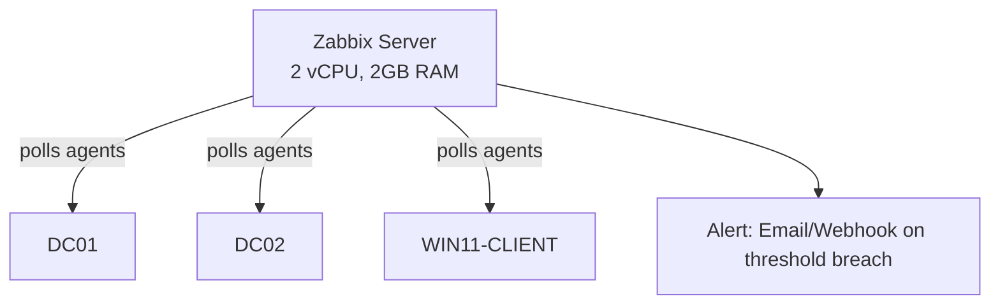

# Infrastructure Monitoring Lab

A Zabbix monitoring deployment watching the [Active Directory lab](https://github.com/EbubeNnaemeka/active-directory-lab) VMs — the kind of operational visibility a NOC/sysadmin role expects on day one: uptime, resource thresholds, and service-level alerting.

## Architecture



## Setup

1. Deploy Zabbix via the official Docker container (fastest path — skips manual MySQL/PostgreSQL setup):
   ```bash
   docker compose up -d
   ```
2. Install the Zabbix agent on each lab VM (DC01, DC02, WIN11-CLIENT), pointed at the Zabbix server's IP.
3. Open firewall ports **10050/tcp** (agent) and **10051/tcp** (server→agent active checks) between the monitoring host and each target.
4. Add each host in the Zabbix web UI (`http://localhost:8080`) using the built-in **Windows/Linux** templates for baseline CPU/disk/memory/service checks.

## Triggers configured

| Trigger | Condition | Severity |
|---|---|---|
| DC service down | AD DS / DNS / DHCP service not running on DC01 or DC02 | Disaster |
| Disk space low | Free disk space < 15% on any monitored host | High |
| High CPU sustained | CPU utilization > 90% for 5+ minutes | Warning |
| Host unreachable | Agent fails to respond to 3 consecutive polls | High |

Full trigger expressions and configuration exported to [`zabbix-templates/lab-triggers.yaml`](zabbix-templates/lab-triggers.yaml).

## Resume bullet (use once you have completed and verified the lab)

> Deployed Zabbix monitoring across a multi-server domain environment; configured service-availability and resource-threshold alerting for domain controllers and client endpoints.

## Repo contents

```
├── README.md
├── docker-compose.yml
└── zabbix-templates/
    └── lab-triggers.yaml
```
